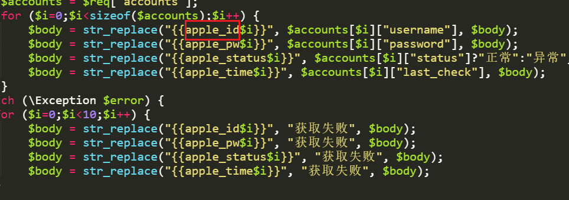

# V2Board知识库调用

## 下载文件

先下载最新版本的[KnowledgeController](https://raw.githubusercontent.com/pplulee/appleid\_auto/backend/backend/templates/v2board.zip)文件

覆盖v2b的同文件，路径（/app/Http/Controllers/User/KnowledgeController.php）

## 修改文件内容

修改KnowledgeController.php文件内红框表示处的分享网页地址，[https://xxx.xxx/shareapi/分享页代码/密码](https://xxx.xxx/shareapi/%E5%88%86%E4%BA%AB%E9%A1%B5%E4%BB%A3%E7%A0%81/%E5%AF%86%E7%A0%81) 如果分享页没有密码，只需要[https://xxx.xxx/shareapi/分享页代码](https://xxx.xxx/shareapi/%E5%88%86%E4%BA%AB%E9%A1%B5%E4%BB%A3%E7%A0%81/%E5%AF%86%E7%A0%81) 即可

<figure><figcaption></figcaption></figure>

## v2b调用

修改完成后在v2b新建知识库内调用

帐号 \{{apple\_id0\}}

密码 \{{apple\_pw0\}}

状态 \{{apple\_status0\}}

更新时间 \{{apple\_time0\}}

.png>)

知识库内的apple\_id等参数要与KnowledgeController.php内的红框内的参数一致即可，数字从0开始计算

<figure><figcaption></figcaption></figure>

## 完成效果

.png>)
